# Math Homework Solver Backend Documentation

## Overview

The Math Homework Solver Backend is a modular, scalable API built with FastAPI that provides AI-powered math problem solving capabilities. The system uses Clean Architecture principles with feature-based modules for better maintainability and extensibility.

## Architecture

### Clean Architecture Layers

The backend follows Clean Architecture principles with clear separation of concerns:

```
src/backend/app/
├── modules/                    # Feature modules
│   ├── auth/                  # Authentication module
│   ├── math_solving/          # Math solving module
│   └── shared/                # Shared components
│       ├── config.py          # Configuration
│       ├── utils.py           # Utilities
│       ├── container.py       # Dependency injection
│       └── database/          # Database clients
├── tests/                     # Test suites
└── docs/                      # Documentation
```

### Module Structure

Each feature module follows the same structure:

```
module_name/
├── domain/
│   ├── entities.py           # Domain entities (business objects)
│   └── interfaces.py         # Domain interfaces (ports)
├── application/
│   ├── use_cases.py          # Application use cases
│   └── dto.py                # Data Transfer Objects
├── infrastructure/
│   ├── repository.py         # Data persistence implementation
│   └── service.py            # External service implementations
└── presentation/
    └── endpoints.py          # API endpoints (controllers)
```

## Features

### Authentication Module (`modules/auth/`)

- **Firebase Authentication**: JWT token-based authentication
- **User Management**: User entity and authentication service
- **Security**: Token verification and user session management

### Math Solving Module (`modules/math_solving/`)

- **AI-Powered Solving**: OpenAI GPT integration for math problem solving
- **Image Processing**: Upload and process math problem images
- **Solution History**: Save and retrieve user's problem history
- **Step-by-Step Solutions**: Detailed solution steps and explanations

### Shared Components (`modules/shared/`)

- **Configuration**: Centralized settings management
- **Database**: Firebase client for Firestore and Storage
- **Dependency Injection**: Container for managing dependencies
- **Utilities**: Common utility functions

## Quick Start

### Prerequisites

- Python 3.11+
- uv package manager
- Firebase project with Firestore and Authentication
- OpenAI API key

### Installation

```bash
cd src/backend
uv sync
```

### Configuration

Create a `.env` file in the backend directory:

```bash
# Firebase Configuration
FIREBASE_PROJECT_ID=your_project_id
FIREBASE_PRIVATE_KEY=your_service_account_private_key
FIREBASE_CLIENT_EMAIL=your_service_account_email
FIREBASE_STORAGE_BUCKET=your_storage_bucket

# OpenAI Configuration
OPENAI_API_KEY=your_openai_api_key
```

### Running the Server

```bash
# Development server
uv run uvicorn app.main:app --reload --host 0.0.0.0 --port 8000

# Production server
uv run uvicorn app.main:app --host 0.0.0.0 --port 8000
```

## API Documentation

### Endpoints

- `GET /` - Root endpoint
- `GET /health` - Health check
- `GET /docs` - Interactive API documentation (Swagger UI)
- `POST /api/v1/solve` - Solve math problem from image
- `GET /api/v1/history` - Get user's solution history
- `DELETE /api/v1/history/{problem_id}` - Delete problem from history

### Authentication

All protected endpoints require a Firebase JWT token in the Authorization header:

```bash
Authorization: Bearer <firebase_jwt_token>
```

## Development

### Code Quality

The project uses several tools for code quality:

- **Ruff**: Fast Python linter
- **Black**: Code formatter
- **MyPy**: Static type checker
- **pytest**: Testing framework

### Running Tests

The project uses a modular testing approach with tests organized by feature:

```bash
# Run all unit tests
python tests/run_tests.py unit

# Run unit tests for specific module
python tests/run_tests.py unit auth
python tests/run_tests.py unit math_solving

# Run integration tests
python tests/run_tests.py integration

# Run evaluation tests
python tests/run_tests.py evaluation

# Run all tests with coverage
python tests/run_tests.py coverage

# Run fast tests only (exclude slow/evaluation)
python tests/run_tests.py fast

# Run code formatting and linting
python tests/run_tests.py format
python tests/run_tests.py lint

# Run comprehensive checks (lint + fast tests)
python tests/run_tests.py check

# Using pytest directly
uv run pytest                                    # All tests
uv run pytest app/modules/auth/tests/ -v        # Auth module tests
uv run pytest tests/integration/ -v             # Integration tests
```

See the [Testing Guide](docs/testing.md) for comprehensive testing documentation.

### Linting and Formatting

```bash
# Format code
uv run black app/

# Lint code
uv run ruff check app/

# Type checking
uv run mypy app/
```

## Deployment

The application can be deployed using Docker:

```bash
# Build image
docker build -t math-solver-backend .

# Run container
docker run -p 8000:8000 --env-file .env math-solver-backend
```

Or using docker-compose:

```bash
docker-compose up -d
```

## Contributing

1. Follow the existing module structure
2. Write tests for new features
3. Ensure code passes all linting checks
4. Update documentation for new features
5. Use meaningful commit messages

## Troubleshooting

See the [Troubleshooting Guide](troubleshooting.md) for common issues and solutions.

## Additional Documentation

- [Authentication Guide](authentication.md) - Firebase JWT authentication setup and usage
- [API Reference](api-reference.md) - Complete API endpoint documentation
- [Testing Guide](testing.md) - Comprehensive testing strategy and guidelines
- [Evaluation Guide](evaluation.md) - AI model evaluation with DeepEval
- [Development Guide](development.md) - Local development setup and workflows
- [Deployment Guide](deployment.md) - Production deployment instructions
- [Migration Guide](migration-guide.md) - Guide for migrating from old structure
- [Troubleshooting Guide](troubleshooting.md) - Common issues and solutions

## Architecture Overview

The new modular architecture provides:

```mermaid
graph TB
    subgraph "🎯 Presentation Layer"
        API[FastAPI Endpoints]
        DTO[Data Transfer Objects]
    end
    
    subgraph "💼 Application Layer"
        UC[Use Cases]
        SERV[Application Services]
    end
    
    subgraph "🏛️ Domain Layer"
        ENT[Entities]
        INTF[Interfaces]
    end
    
    subgraph "🔧 Infrastructure Layer"
        REPO[Repositories]
        EXT[External Services]
    end
    
    API --> UC
    UC --> ENT
    UC --> INTF
    REPO --> INTF
    EXT --> INTF
```



### Key Improvements

- ✅ **Clean Architecture**: Clear separation of concerns
- ✅ **Feature Modules**: Organized by business capabilities
- ✅ **Dependency Injection**: Better testability and flexibility
- ✅ **Type Safety**: Full type hints throughout
- ✅ **Centralized Documentation**: All docs in one place
- ✅ **Scalable Structure**: Easy to extend and maintain
